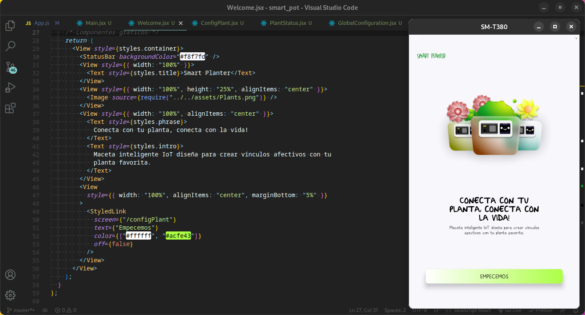

# ⚠️ About this project:

    This is a final university project, possibly my tesis in the next monts of year 2023.

    It's about an application for query a smart pot parameters through internet of things.

    For the purpose of help the users to undertand yours smart pot in case it to project an animation unknow. For example next animation:

Smart Pot.

    This application has five views,  Welcome view, Sign in view, Plant status view and Global configuration view.

    It's developed on React Native with Expo and Firebase services, specifically Realtime Database for data interactión between smart pot and mobile app.

# 📱 Views:

 Welcome view.

 Sign In view.

 Status plant view.

 Global configuration view.

# ⚙️ Applying tests:

 Normal parameters.

 Modifying soil moisture parameter.
